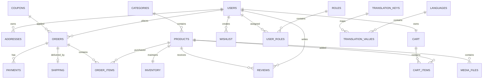

# 🗄️ Database Architecture

## Overview

Vynk uses **PostgreSQL** as its primary relational database, designed around a modular domain-driven architecture to support enterprise e-commerce workflows.

The database is normalized to reduce redundancy while maintaining high data integrity through foreign key constraints, transactional consistency, and clear domain boundaries.

Database schema evolution is managed using **Flyway**, ensuring every structural change is version-controlled and repeatable across development, testing, and production environments.

---

# 🎯 Design Goals

The database is designed to support:

- Secure User Authentication & Authorization
- Product Catalog Management
- Inventory Tracking
- Shopping Cart Management
- Order Processing
- Payment Lifecycle
- Shipping & Fulfillment
- Product Reviews
- Wishlist Management
- Notification System
- Multi-language Localization
- Enterprise Data Integrity

---

# 🏛 Database Architecture

The schema is organized into multiple business domains.

```
                     Vynk Database

             ┌───────────────────────┐
             │     Identity Domain   │
             └───────────────────────┘
                       │
                       ▼
             ┌───────────────────────┐
             │     Catalog Domain    │
             └───────────────────────┘
                       │
                       ▼
             ┌───────────────────────┐
             │    Commerce Domain    │
             └───────────────────────┘
                       │
                       ▼
             ┌───────────────────────┐
             │     Platform Domain   │
             └───────────────────────┘
```

Each domain owns a specific business responsibility, making the schema easier to maintain and extend.

---

# 📦 Domain Breakdown

## 🔐 Identity Domain

Responsible for authentication, authorization, and user profile management.

### Tables

```
users
roles
user_roles
addresses
email_verification_tokens
password_reset_tokens
```

### Responsibilities

- User Accounts
- Login Credentials
- RBAC
- Address Management
- Email Verification
- Password Recovery

---

## 📦 Catalog Domain

Responsible for everything related to products.

### Tables

```
categories
products
inventory
media_files
reviews
wishlist
```

### Responsibilities

- Product Catalog
- Categories
- Product Images
- Inventory Tracking
- Customer Reviews
- Wishlist

---

## 🛒 Commerce Domain

Responsible for the purchasing lifecycle.

### Tables

```
cart
cart_items
orders
order_items
payments
shipping
coupons
```

### Responsibilities

- Shopping Cart
- Checkout
- Orders
- Payment Processing
- Shipping
- Coupon Management

---

## 🌍 Platform Domain

Supports platform-wide capabilities.

### Tables

```
notifications
languages
translation_keys
translation_values
```

### Responsibilities

- Notifications
- Localization
- Multi-language Support
- Translation Management

---

# 🔗 Entity Relationships

The following diagram illustrates how the primary business entities interact throughout the application.



---

# 🛍 Business Workflow

## Customer Registration

```
User
 │
 ├── Address
 ├── Roles
 ├── Cart
 ├── Wishlist
 └── Reviews
```

---

## Shopping Workflow

```
Category
    │
Product
    │
Inventory
    │
Cart
    │
Order
    │
Payment
    │
Shipping
```

---

## Inventory Lifecycle

```
Product Created
        │
        ▼
Inventory Initialized
        │
        ▼
Customer Places Order
        │
        ▼
Payment Successful
        │
        ▼
Inventory Reserved
        │
        ▼
Order Delivered
        │
        ▼
Inventory Updated
```

---

# 💳 Order Processing Lifecycle

```
Cart
   │
   ▼
Checkout
   │
   ▼
Order Created
   │
   ▼
Payment Authorized
   │
   ▼
Inventory Reserved
   │
   ▼
Shipment Created
   │
   ▼
Order Delivered
   │
   ▼
Payment Completed
```

---

# ⚙ Database Technology Stack

| Component | Technology |
|------------|-------------|
| Database | PostgreSQL 16 |
| ORM | Hibernate ORM |
| Persistence | Spring Data JPA |
| Schema Versioning | Flyway |
| Connection Pool | HikariCP |
| Transactions | Spring Transaction Management |
| Query Language | JPQL & Native SQL |

---

# 🔒 Database Design Principles

The database follows several enterprise design principles:

- Third Normal Form (3NF)
- Foreign Key Constraints
- Transactional Consistency
- Soft Delete Support (where applicable)
- Optimized Relationships
- UUID / Sequence-Based Primary Keys
- Domain Separation
- Audit-Friendly Structure
- Flyway Version Control

---

# 🚀 Future Enhancements

The database schema is designed for future scalability.

Upcoming enhancements include:

- Product Recommendations
- Audit Logging
- Event Outbox Pattern
- Inventory Reservation Improvements
- Analytics Tables
- Reporting Views
- Database Index Optimization
- Read Replica Support

---

# 📈 Current Database Coverage

| Module | Status |
|----------|:------:|
| Authentication | ✅ |
| User Management | ✅ |
| Product Catalog | ✅ |
| Categories | ✅ |
| Inventory | ✅ |
| Shopping Cart | ✅ |
| Orders | ✅ |
| Payments | ✅ |
| Shipping | ✅ |
| Notifications | 📋 |
| Localization | ✅ |

---

# 📌 Summary

The Vynk database is designed using enterprise software engineering principles with clear domain separation, normalized relational modeling, transactional integrity, and extensibility in mind.

The architecture provides a scalable foundation capable of supporting modern e-commerce workflows while remaining maintainable as new business capabilities are introduced.