# 🗄️ Database Architecture & Entity Relationship Diagram (ERD)

## Overview

CommerceHub uses PostgreSQL as the primary relational database.

The database follows an enterprise ecommerce architecture designed for:

- Product catalog management
- User authentication and authorization
- Shopping cart management
- Order lifecycle processing
- Payment processing
- Inventory reservation and deduction
- Shipping workflow
- Reviews and wishlist management
- Notification and localization support
- Database version control using Flyway


## Database Design Principles

### 1. Domain Separation

Database entities are separated into business domains:

```
Identity Domain
|
├── users
├── roles
├── user_roles
├── addresses
├── email_verification_tokens
└── password_reset_tokens


Catalog Domain
|
├── categories
├── products
├── inventory
├── media_files
└── reviews


Commerce Domain
|
├── cart
├── cart_items
├── orders
├── order_items
├── coupons
├── payments
└── shipping


Platform Domain
|
├── notifications
├── languages
├── translation_keys
└── translation_values
```


---

# Entity Relationship Diagram

```mermaid
erDiagram


%% =========================
%% USER MANAGEMENT
%% =========================


USERS ||--o{ ADDRESSES : owns

USERS ||--o{ ORDERS : places

USERS ||--|| CART : owns

USERS ||--o{ REVIEWS : writes

USERS ||--o{ WISHLIST : creates


USERS ||--o{ EMAIL_VERIFICATION_TOKENS : receives

USERS ||--o{ PASSWORD_RESET_TOKENS : generates



ROLES ||--o{ USER_ROLES : contains

USERS ||--o{ USER_ROLES : assigned



%% =========================
%% PRODUCT CATALOG
%% =========================


CATEGORIES ||--o{ PRODUCTS : contains


PRODUCTS ||--|| INVENTORY : maintains


PRODUCTS ||--o{ MEDIA_FILES : contains


PRODUCTS ||--o{ REVIEWS : receives


PRODUCTS ||--o{ WISHLIST : saved



%% =========================
%% CART
%% =========================


CART ||--o{ CART_ITEMS : contains


PRODUCTS ||--o{ CART_ITEMS : added



%% =========================
%% ORDER MANAGEMENT
%% =========================


USERS ||--o{ ORDERS : creates


ORDERS ||--o{ ORDER_ITEMS : contains


PRODUCTS ||--o{ ORDER_ITEMS : purchased



ADDRESSES ||--o{ ORDERS : shipping_address



COUPONS ||--o{ ORDERS : applied



%% =========================
%% PAYMENT
%% =========================


ORDERS ||--o{ PAYMENTS : has



%% =========================
%% SHIPPING
%% =========================


ORDERS ||--o| SHIPPING : has



%% =========================
%% NOTIFICATION
%% =========================


USERS ||--o{ NOTIFICATIONS : receives



%% =========================
%% LOCALIZATION
%% =========================


LANGUAGES ||--o{ TRANSLATION_VALUES : contains

TRANSLATION_KEYS ||--o{ TRANSLATION_VALUES : maps



%% =========================
%% TABLE DEFINITIONS
%% =========================



USERS {

bigint id PK

varchar email

varchar password

varchar first_name

varchar last_name

boolean enabled

timestamp created_at

timestamp updated_at

}



ROLES {

bigint id PK

varchar name

varchar description

}



USER_ROLES {

bigint user_id FK

bigint role_id FK

}



ADDRESSES {

bigint id PK

bigint user_id FK

varchar address_line1

varchar city

varchar state

varchar country

varchar postal_code

boolean is_default

}



CATEGORIES {

bigint id PK

varchar name

varchar description

}



PRODUCTS {

bigint id PK

bigint category_id FK

varchar name

varchar description

decimal price

varchar image_url

boolean active

}



INVENTORY {

bigint id PK

bigint product_id FK

bigint quantity

bigint reserved

bigint reorder_level

}



MEDIA_FILES {

bigint id PK

bigint product_id FK

varchar file_name

varchar file_url

varchar file_type

}



CART {

bigint id PK

bigint user_id FK

timestamp created_at

timestamp updated_at

}



CART_ITEMS {

bigint id PK

bigint cart_id FK

bigint product_id FK

bigint quantity

}



ORDERS {

bigint id PK

bigint user_id FK

varchar order_number

decimal total_amount

decimal tax_amount

decimal discount_amount

varchar status

varchar payment_status

bigint shipping_address_id FK

}



ORDER_ITEMS {

bigint id PK

bigint order_id FK

bigint product_id FK

bigint quantity

decimal price

decimal subtotal

decimal discount

decimal tax

decimal total

}



PAYMENTS {

bigint id PK

bigint order_id FK

decimal amount

varchar status

varchar method

varchar transaction_id

varchar gateway_name

}



SHIPPING {

bigint id PK

bigint order_id FK

varchar status

varchar carrier

varchar tracking_number

timestamp estimated_delivery

timestamp actual_delivery

}



COUPONS {

bigint id PK

varchar code

decimal discount_value

timestamp expiry_date

}



REVIEWS {

bigint id PK

bigint user_id FK

bigint product_id FK

integer rating

text comment

}



WISHLIST {

bigint id PK

bigint user_id FK

bigint product_id FK

}



EMAIL_VERIFICATION_TOKENS {

bigint id PK

bigint user_id FK

varchar token

timestamp expiry_date

}



PASSWORD_RESET_TOKENS {

bigint id PK

bigint user_id FK

varchar token

timestamp expiry_date

}



NOTIFICATIONS {

bigint id PK

bigint user_id FK

varchar title

varchar message

boolean read

}



LANGUAGES {

bigint id PK

varchar code

varchar name

}



TRANSLATION_KEYS {

bigint id PK

varchar key_name

}



TRANSLATION_VALUES {

bigint id PK

bigint language_id FK

bigint translation_key_id FK

text value

}

```





---

# 🔄 CommerceHub Business Flow Relationship


## 1. Customer Registration Flow


```
USER

 |

 +---- ADDRESS

 |

 +---- ROLE

 |

 +---- CART

 |

 +---- WISHLIST

 |

 +---- REVIEWS

```


## 2. Product Purchase Flow


```
CATEGORY

   |

   |

 PRODUCT

   |

   |

 INVENTORY


Customer Cart

   |

   |

ORDER

   |

   |

ORDER_ITEMS

   |

   |

PAYMENT

   |

   |

SHIPPING

```


## 3. Inventory Lifecycle


```
Product Created

        |

        ↓

Inventory Created


        |

        ↓

Order Created

        |

        ↓

Payment SUCCESS

        |

        ↓

Inventory RESERVED


        |

        ↓

Shipment DELIVERED


        |

        ↓

Inventory Deducted


```


Example:

Before payment:

```
quantity = 50

reserved = 0
```


After successful payment:

```
quantity = 50

reserved = 2
```


After delivery:

```
quantity = 48

reserved = 0
```


---

# 🏗 Database Technology Stack


| Component | Technology |
|---|---|
| Database | PostgreSQL |
| ORM | Hibernate / Spring Data JPA |
| Migration | Flyway |
| Transaction Management | Spring @Transactional |
| Connection Pool | HikariCP |
| Query Language | JPQL + Native SQL |


---

# Database Tables Count

Current CommerceHub Database:

```
44 Tables

Identity:
9 tables

Catalog:
6 tables

Commerce:
9 tables

Platform:
5 tables

Migration:
1 table
```


---

# Enterprise Features Supported


✅ Normalized relational schema  
✅ Foreign key integrity  
✅ Transaction-safe order processing  
✅ Inventory reservation system  
✅ Payment lifecycle management  
✅ Shipment tracking workflow  
✅ RBAC authorization model  
✅ Audit-ready structure  
✅ Localization support  
✅ Database version control